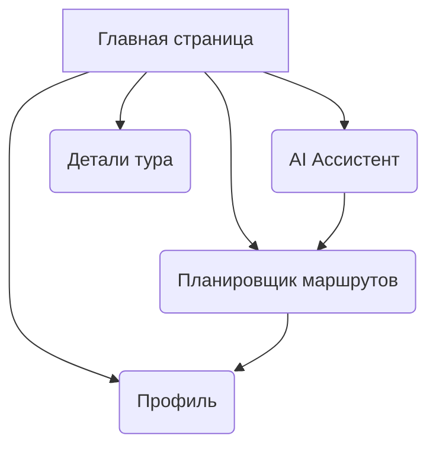
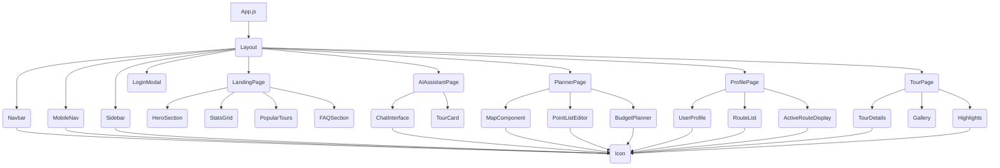

# Техническое Задание и Agile Backlog: TravelPlanner

## A) Inventory: Pages + Components

### Структура страниц (Routes)



- [`/`](./components/LandingPage.js): Главная страница
- [`/ai-assistant`](./components/AIAssistantPage.js): AI Ассистент
- [`/planner`](./components/PlannerPage.js): Планировщик маршрутов
- [`/profile`](./components/ProfilePage.js): Профиль пользователя
- [`/tour/:id`](./components/TourPage.js): Детали тура

### Ключевые компоненты (UI + Feature Components)



**Общие компоненты:**
- [`<Icon />`](./icons.js): Компонент для отображения иконок. (UI)
- [`<Layout />`](./App.js): Общая структура приложения (шапка, подвал, навигация). (UI)
- [`<Navbar />`](./App.js): Навигационная панель для десктопа. (UI)
- [`<MobileNav />`](./App.js): Навигационная панель для мобильных устройств. (UI)
- [`<Sidebar />`](./App.js): Боковая навигационная панель. (UI)
- [`<LoginModal />`](./App.js): Модальное окно для входа/регистрации. (UI/Feature)
- `TourCard`: Карточка тура с изображением, названием, тегами, ценой и погодой. (UI)

**Компоненты LandingPage:**
- [`<HeroSection />`](./components/LandingPage.js): Главный экран с видеофоном и поиском. (UI/Feature)
- [`<StatsGrid />`](./components/LandingPage.js): Сетка со статистическими данными. (UI)
- [`<PopularTours />`](./components/LandingPage.js): Секция с популярными турами. (Feature)
- [`<FAQSection />`](./components/LandingPage.js): Секция часто задаваемых вопросов. (UI)

**Компоненты AIAssistantPage:**
- [`<ChatInterface />`](./components/AIAssistantPage.js): Интерфейс чата с AI. (Feature)
- `ChatMessage`: Компонент для отображения сообщений в чате. (UI)

**Компоненты PlannerPage:**
- [`<MapComponent />`](./components/PlannerPage.js): Интерактивная карта для отображения маршрута. (Feature)
- [`<PointListEditor />`](./components/PlannerPage.js): Редактор списка точек маршрута с возможностью добавления/удаления/редактирования. (Feature)
- [`<BudgetPlanner />`](./components/PlannerPage.js): Компонент для планирования бюджета маршрута. (Feature)

**Компоненты ProfilePage:**
- [`<UserProfile />`](./components/ProfilePage.js): Отображение и редактирование данных пользователя (имя, фото). (Feature)
- [`<RouteList />`](./components/ProfilePage.js): Список сохраненных и активных маршрутов. (Feature)
- [`<ActiveRouteDisplay />`](./components/ActiveRouteDisplay.js): Детальное отображение активного маршрута с картой. (Feature)

**Компоненты TourPage:**
- [`<TourDetails />`](./components/TourPage.js): Основная информация о туре, описание, галерея. (Feature)
- `TourGallery`: Галерея изображений тура. (UI)
- `TourHighlights`: Список преимуществ/особенностей тура. (UI)


## B) Backlog: Epics → User Stories → Tasks

### Эпик: Core UI/UX & Навигация

**User Story: Как пользователь, я хочу видеть удобную и интуитивно понятную навигацию, чтобы легко перемещаться по приложению.**
-   **Acceptance Criteria:**
    -   `Given` я нахожусь на любой странице приложения
    -   `When` я использую десктоп
    -   `Then` я вижу `Navbar` с логотипом и кнопками навигации
    -   `Given` я нахожусь на любой странице приложения
    -   `When` я использую мобильное устройство
    -   `Then` я вижу `MobileNav` внизу экрана с основными разделами
    -   `Given` я нахожусь на внутренних страницах (`ai-assistant`, `planner`, `profile`)
    -   `When` я использую десктоп
    -   `Then` я вижу `Sidebar` с кнопками навигации

    **Tasks:**
    -   **Task:** Разработать компонент [`Navbar`](./App.js) с логотипом и кнопками. (2h)
        -   **Dependencies:** Нет
        -   **Files/Folders:** [`App.js`](./App.js), [`style.css`](./style.css), [`icons.js`](./icons.js)
        -   **Definition of Done:** `Navbar` отображается корректно на всех страницах (кроме `landing` на мобильных), содержит логотип и кнопки. Кнопки функциональны.
    -   **Task:** Разработать компонент [`MobileNav`](./App.js) с основными разделами. (2h)
        -   **Dependencies:** Нет
        -   **Files/Folders:** [`App.js`](./App.js), [`style.css`](./style.css), [`icons.js`](./icons.js)
        -   **Definition of Done:** `MobileNav` отображается корректно на мобильных устройствах, содержит кнопки навигации. Кнопки функциональны.
    -   **Task:** Разработать компонент [`Sidebar`](./App.js) для десктопа на внутренних страницах. (2h)
        -   **Dependencies:** Нет
        -   **Files/Folders:** [`App.js`](./App.js), [`style.css`](./style.css), [`icons.js`](./icons.js)
        -   **Definition of Done:** `Sidebar` отображается корректно на десктопе для внутренних страниц. Кнопки функциональны.
    -   **Task:** Интегрировать `Navbar`, `MobileNav`, `Sidebar` в [`Layout`](./App.js). (2h)
        -   **Dependencies:** `Navbar`, `MobileNav`, `Sidebar`
        -   **Files/Folders:** [`App.js`](./App.js)
        -   **Definition of Done:** Навигационные компоненты корректно отображаются и переключаются в зависимости от разрешения экрана и текущей страницы.

### Эпик: Аутентификация

**User Story: Как пользователь, я хочу иметь возможность входить в систему и регистрироваться, чтобы получать доступ к персонализированным функциям.**
-   **Acceptance Criteria:**
    -   `Given` я не авторизован
    -   `When` я нажимаю кнопку "Войти"
    -   `Then` я вижу модальное окно `LoginModal`
    -   `Given` я нахожусь в `LoginModal`
    -   `When` я ввожу корректные данные и нажимаю "Войти"
    -   `Then` я авторизуюсь и попадаю на страницу профиля
    -   `Given` я нахожусь в `LoginModal`
    -   `When` я переключаюсь на режим регистрации, ввожу данные и нажимаю "Зарегистрироваться"
    -   `Then` я регистрируюсь, авторизуюсь и попадаю на страницу профиля

    **Tasks:**
    -   **Task:** Разработать компонент [`LoginModal`](./App.js) с формами входа и регистрации. (4h)
        -   **Dependencies:** Нет
        -   **Files/Folders:** [`App.js`](./App.js), [`style.css`](./style.css), [`icons.js`](./icons.js)
        -   **Definition of Done:** `LoginModal` отображается с двумя вкладками (вход/регистрация), содержит поля ввода и кнопки. Модальное окно закрывается по кнопке или клику вне его.
    -   **Task:** Реализовать базовую логику аутентификации (мок-данные). (4h)
        -   **Dependencies:** `LoginModal`
        -   **Files/Folders:** [`App.js`](./App.js)
        -   **Definition of Done:** Пользователь может "войти" или "зарегистрироваться" с использованием мок-данных, состояние `user` обновляется.

### Эпик: Главная страница (Landing Page)

**User Story: Как посетитель, я хочу видеть привлекательную главную страницу с информацией о сервисе и популярными турами, чтобы заинтересоваться и начать планирование.**
-   **Acceptance Criteria:**
    -   `Given` я открываю приложение
    -   `Then` я вижу [`HeroSection`](./components/LandingPage.js) с видеофоном, заголовком и полем поиска AI
    -   `Then` я вижу [`StatsGrid`](./components/LandingPage.js) с ключевой статистикой
    -   `Then` я вижу [`PopularTours`](./components/LandingPage.js) с карточками популярных туров, которые можно фильтровать
    -   `Then` я вижу [`FAQSection`](./components/LandingPage.js) с ответами на частые вопросы

    **Tasks:**
    -   **Task:** Разработать [`HeroSection`](./components/LandingPage.js) с видеофоном и полем поиска. (4h)
        -   **Dependencies:** [`<Icon />`](./icons.js)
        -   **Files/Folders:** [`components/LandingPage.js`](./components/LandingPage.js), [`style.css`](./style.css), [`assets/video`](./assets/video)
        -   **Definition of Done:** Видеофон корректно воспроизводится, заголовок и поле поиска отображаются, поле поиска интерактивно.
    -   **Task:** Разработать [`StatsGrid`](./components/LandingPage.js) (сетка статистики). (2h)
        -   **Dependencies:** Нет
        -   **Files/Folders:** [`components/LandingPage.js`](./components/LandingPage.js)
        -   **Definition of Done:** `StatsGrid` отображается с корректными данными и стилями.
    -   **Task:** Разработать `TourCard` для отображения туров. (3h)
        -   **Dependencies:** [`<Icon />`](./icons.js)
        -   **Files/Folders:** [`components/LandingPage.js`](./components/LandingPage.js), [`style.css`](./style.css)
        -   **Definition of Done:** `TourCard` отображает всю необходимую информацию о туре, включая теги и иконку погоды.
    -   **Task:** Разработать [`PopularTours`](./components/LandingPage.js) секцию с фильтрацией. (4h)
        -   **Dependencies:** `TourCard`
        -   **Files/Folders:** [`components/LandingPage.js`](./components/LandingPage.js), [`style.css`](./style.css)
        -   **Definition of Done:** `PopularTours` отображает список туров, фильтры функциональны, при клике на тур происходит переход на `TourPage`.
    -   **Task:** Разработать [`FAQSection`](./components/LandingPage.js). (3h)
        -   **Dependencies:** Нет
        -   **Files/Folders:** [`components/LandingPage.js`](./components/LandingPage.js), [`style.css`](./style.css)
        -   **Definition of Done:** `FAQSection` отображает список вопросов и ответов с корректными стилями.

### Эпик: AI Ассистент

**User Story: Как пользователь, я хочу взаимодействовать с AI ассистентом для быстрого получения информации и планирования маршрутов.**
-   **Acceptance Criteria:**
    -   `Given` я нахожусь на странице `AI Ассистент`
    -   `When` я ввожу запрос в чат
    -   `Then` AI ассистент отвечает на мой запрос
    -   `Given` AI предлагает тур
    -   `When` я нажимаю на предложенный тур
    -   `Then` я перехожу на страницу `TourPage`

    **Tasks:**
    -   **Task:** Разработать [`ChatInterface`](./components/AIAssistantPage.js) с полем ввода и отображением сообщений. (4h)
        -   **Dependencies:** `ChatMessage`, [`<Icon />`](./icons.js)
        -   **Files/Folders:** [`components/AIAssistantPage.js`](./components/AIAssistantPage.js), [`style.css`](./style.css)
        -   **Definition of Done:** Интерфейс чата позволяет вводить сообщения и отображает их, включая ответы AI.
    -   **Task:** Реализовать базовую логику взаимодействия с AI (мок-ответы). (3h)
        -   **Dependencies:** `ChatInterface`
        -   **Files/Folders:** [`components/AIAssistantPage.js`](./components/AIAssistantPage.js)
        -   **Definition of Done:** AI отвечает на простые запросы мок-данными. Может предлагать туры.
    -   **Task:** Разработать компонент `ChatMessage` для различных типов сообщений. (2h)
        -   **Dependencies:** Нет
        -   **Files/Folders:** [`components/AIAssistantPage.js`](./components/AIAssistantPage.js), [`style.css`](./style.css)
        -   **Definition of Done:** Сообщения пользователя и AI отображаются с соответствующими стилями. Поддерживается отображение `TourCard`.

### Эпик: Планировщик маршрутов

**User Story: Как пользователь, я хочу создавать и редактировать собственные маршруты, чтобы планировать путешествия под свои нужды.**
-   **Acceptance Criteria:**
    -   `Given` я нахожусь на странице `Планировщик маршрутов`
    -   `When` я добавляю точки на карту через поиск
    -   `Then` точки отображаются на карте и в списке
    -   `Given` у меня есть маршрут с точками
    -   `When` я редактирую бюджет или название точки
    -   `Then` изменения сохраняются и отображаются
    -   `When` я нажимаю кнопку "Сохранить маршрут"
    -   `Then` маршрут сохраняется в моем профиле

    **Tasks:**
    -   **Task:** Разработать [`MapComponent`](./components/PlannerPage.js) с возможностью добавления и перемещения маркеров. (4h)
        -   **Dependencies:** Yandex.Maps API
        -   **Files/Folders:** [`components/PlannerPage.js`](./components/PlannerPage.js), [`index.html`](./index.html)
        -   **Definition of Done:** Карта отображается, маркеры добавляются по поиску, линии соединяют точки, маркеры можно перемещать.
    -   **Task:** Разработать [`PointListEditor`](./components/PlannerPage.js) для управления точками маршрута. (4h)
        -   **Dependencies:** [`<Icon />`](./icons.js)
        -   **Files/Folders:** [`components/PlannerPage.js`](./components/PlannerPage.js), [`style.css`](./style.css)
        -   **Definition of Done:** Список точек отображается, можно добавлять, удалять, редактировать название и бюджет.
    -   **Task:** Разработать [`BudgetPlanner`](./components/PlannerPage.js) с расчетом общего бюджета. (3h)
        -   **Dependencies:** `PointListEditor`
        -   **Files/Folders:** [`components/PlannerPage.js`](./components/PlannerPage.js), [`style.css`](./style.css)
        -   **Definition of Done:** Отображается планируемый и текущий бюджет, изменения в точках маршрута обновляют общий бюджет.
    -   **Task:** Интегрировать `MapComponent`, `PointListEditor`, `BudgetPlanner`. (2h)
        -   **Dependencies:** `MapComponent`, `PointListEditor`, `BudgetPlanner`
        -   **Files/Folders:** [`components/PlannerPage.js`](./components/PlannerPage.js)
        -   **Definition of Done:** Все компоненты планировщика работают как единое целое, маршрут можно сохранять.

### Эпик: Профиль пользователя

**User Story: Как пользователь, я хочу управлять своим профилем и просматривать сохраненные маршруты.**
-   **Acceptance Criteria:**
    -   `Given` я нахожусь на странице `Профиль`
    -   `When` я редактирую свое имя или фото
    -   `Then` изменения сохраняются и отображаются
    -   `Then` я вижу список своих сохраненных маршрутов
    -   `When` я делаю маршрут активным
    -   `Then` он отображается в секции активного маршрута с картой
    -   `When` я нажимаю "Редактировать" для маршрута
    -   `Then` я перехожу на страницу `Планировщика маршрутов` с предзагруженным маршрутом

    **Tasks:**
    -   **Task:** Разработать [`UserProfile`](./components/ProfilePage.js) для отображения и редактирования данных. (3h)
        -   **Dependencies:** [`<Icon />`](./icons.js)
        -   **Files/Folders:** [`components/ProfilePage.js`](./components/ProfilePage.js), [`style.css`](./style.css)
        -   **Definition of Done:** Профиль отображает имя и фото, имя можно редактировать, фото можно менять.
    -   **Task:** Разработать [`RouteList`](./components/ProfilePage.js) для отображения сохраненных маршрутов. (4h)
        -   **Dependencies:** [`<Icon />`](./icons.js)
        -   **Files/Folders:** [`components/ProfilePage.js`](./components/ProfilePage.js), [`style.css`](./style.css)
        -   **Definition of Done:** Список маршрутов отображается, каждый маршрут имеет переключатель активности и кнопку редактирования.
    -   **Task:** Разработать [`ActiveRouteDisplay`](./components/ActiveRouteDisplay.js) для активного маршрута. (4h)
        -   **Dependencies:** Yandex.Maps API, [`<Icon />`](./icons.js)
        -   **Files/Folders:** [`components/ActiveRouteDisplay.js`](./components/ActiveRouteDisplay.js), [`style.css`](./style.css), [`index.html`](./index.html)
        -   **Definition of Done:** Активный маршрут отображается на интерактивной карте с точками.
    -   **Task:** Интегрировать `UserProfile`, `RouteList`, `ActiveRouteDisplay`. (2h)
        -   **Dependencies:** `UserProfile`, `RouteList`, `ActiveRouteDisplay`
        -   **Files/Folders:** [`components/ProfilePage.js`](./components/ProfilePage.js)
        -   **Definition of Done:** Страница профиля отображает всю необходимую информацию и функциональность.

### Эпик: Детали тура

**User Story: Как пользователь, я хочу просматривать подробную информацию о выбранном туре, чтобы принять решение о бронировании или планировании.**
-   **Acceptance Criteria:**
    -   `Given` я нахожусь на странице `Детали тура`
    -   `Then` я вижу Hero Section с изображением, названием, тегами, длительностью и количеством человек
    -   `Then` я вижу подробное описание тура
    -   `Then` я вижу галерею изображений тура
    -   `Then` я вижу список включенных услуг/особенностей
    -   `Then` я вижу стоимость тура и кнопку "Забронировать"

    **Tasks:**
    -   **Task:** Разработать [`TourDetails`](./components/TourPage.js) (Hero Section, описание, галерея). (4h)
        -   **Dependencies:** [`<Icon />`](./icons.js)
        -   **Files/Folders:** [`components/TourPage.js`](./components/TourPage.js), [`style.css`](./style.css)
        -   **Definition of Done:** Отображается Hero Section, подробное описание, галерея изображений, список включенных услуг.
    -   **Task:** Добавить секцию со стоимостью и кнопкой "Забронировать". (2h)
        -   **Dependencies:** Нет
        -   **Files/Folders:** [`components/TourPage.js`](./components/TourPage.js), [`style.css`](./style.css)
        -   **Definition of Done:** Отображается стоимость тура и функциональная кнопка "Забронировать".


## C) Sprint Plan

### Sprint 1: MVP Core UI/UX & Landing Page (Цель: Базовое приложение с работающей главной страницей и навигацией)

-   **Эпик: Core UI/UX & Навигация**
    -   Task: Разработать компонент [`Navbar`](./App.js) (2h)
    -   Task: Разработать компонент [`MobileNav`](./App.js) (2h)
    -   Task: Разработать компонент [`Sidebar`](./App.js) (2h)
    -   Task: Интегрировать `Navbar`, `MobileNav`, `Sidebar` в [`Layout`](./App.js) (2h)
-   **Эпик: Главная страница (Landing Page)**
    -   Task: Разработать [`HeroSection`](./components/LandingPage.js) (4h)
    -   Task: Разработать [`StatsGrid`](./components/LandingPage.js) (2h)
    -   Task: Разработать `TourCard` для отображения туров (3h)
    -   Task: Разработать [`PopularTours`](./components/LandingPage.js) секцию с фильтрацией (4h)
    -   Task: Разработать [`FAQSection`](./components/LandingPage.js) (3h)
-   **Эпик: Аутентификация**
    -   Task: Разработать компонент [`LoginModal`](./App.js) (4h)
    -   Task: Реализовать базовую логику аутентификации (мок-данные) (4h)

### Sprint 2: AI Assistant & Tour Details (Цель: Расширение функционала с AI и просмотром туров)

-   **Эпик: AI Ассистент**
    -   Task: Разработать [`ChatInterface`](./components/AIAssistantPage.js) (4h)
    -   Task: Реализовать базовую логику взаимодействия с AI (мок-ответы) (3h)
    -   Task: Разработать компонент `ChatMessage` (2h)
-   **Эпик: Детали тура**
    -   Task: Разработать [`TourDetails`](./components/TourPage.js) (Hero Section, описание, галерея) (4h)
    -   Task: Добавить секцию со стоимостью и кнопкой "Забронировать" (2h)

### Sprint 3: Planner & Profile (Цель: Полностью функциональный планировщик и профиль пользователя)

-   **Эпик: Планировщик маршрутов**
    -   Task: Разработать [`MapComponent`](./components/PlannerPage.js) (4h)
    -   Task: Разработать [`PointListEditor`](./components/PlannerPage.js) (4h)
    -   Task: Разработать [`BudgetPlanner`](./components/PlannerPage.js) (3h)
    -   Task: Интегрировать `MapComponent`, `PointListEditor`, `BudgetPlanner` (2h)
-   **Эпик: Профиль пользователя**
    -   Task: Разработать [`UserProfile`](./components/ProfilePage.js) (3h)
    -   Task: Разработать [`RouteList`](./components/ProfilePage.js) (4h)
    -   Task: Разработать [`ActiveRouteDisplay`](./components/ActiveRouteDisplay.js) (4h)
    -   Task: Интегрировать `UserProfile`, `RouteList`, `ActiveRouteDisplay` (2h)


## D) Риски/Неясности & Что нужно уточнить позже

### Риски:
-   **Интеграция с Yandex.Maps API:** Возможны сложности с кастомизацией или специфическими требованиями к отображению.
-   **Производительность AI:** Мок-данные не отражают реальную задержку ответов AI, что может повлиять на UX.
-   **Состояние и синхронизация:** Управление глобальным состоянием (маршруты, данные пользователя) между различными компонентами может стать сложным без четкой архитектуры Redux/Zustand.

### Неясности:
-   Точная спецификация API для бэкенда (аутентификация, сохранение/загрузка маршрутов, запросы к AI).
-   Дизайн состояний `loading`/`empty`/`error` для каждого компонента.
-   Детали взаимодействия с платежной системой для "бронирования" туров.

### Что нужно уточнить позже:
-   Детали реализации бэкенда и API-контрактов.
-   Выбор библиотеки для управления состоянием (Recoil/Jotai/Zustand/Redux).
-   Стратегия обработки ошибок и отображения уведомлений пользователю. 
-   Потребность в дополнительных страницах (например, страница "Мои бронирования").

```mermaid
sequenceDiagram
    participant User
    participant Frontend
    participant Backend

    User->>Frontend: Открывает Landing Page
    Frontend->>Frontend: Рендерит HeroSection, StatsGrid, PopularTours, FAQSection
    User->>Frontend: Вводит запрос в поиск AI
    Frontend->>Backend: Отправляет запрос AI (mock)
    Backend-->>Frontend: Возвращает ответ (mock)
    Frontend->>User: Отображает ответ AI / переходит на Tour Page
    User->>Frontend: Переходит на Planner Page
    Frontend->>Frontend: Рендерит MapComponent, PointListEditor, BudgetPlanner
    User->>Frontend: Добавляет/редактирует точки маршрута
    Frontend->>Backend: Сохраняет маршрут (mock)
    Backend-->>Frontend: Подтверждение сохранения
    User->>Frontend: Переходит на Profile Page
    Frontend->>Backend: Запрашивает данные пользователя/маршруты (mock)
    Backend-->>Frontend: Возвращает данные (mock)
    Frontend->>User: Отображает UserProfile, RouteList, ActiveRouteDisplay
    User->>Frontend: Нажимает "Войти"
    Frontend->>Frontend: Отображает LoginModal
    User->>Frontend: Вводит учетные данные
    Frontend->>Backend: Отправляет запрос аутентификации (mock)
    Backend-->>Frontend: Возвращает токен (mock)
    Frontend->>User: Авторизует пользователя, перенаправляет на Profile Page